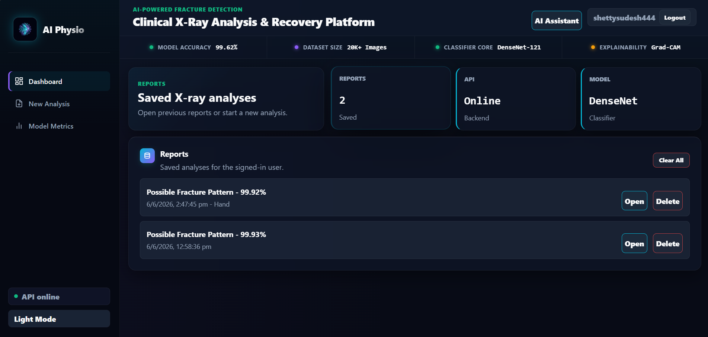
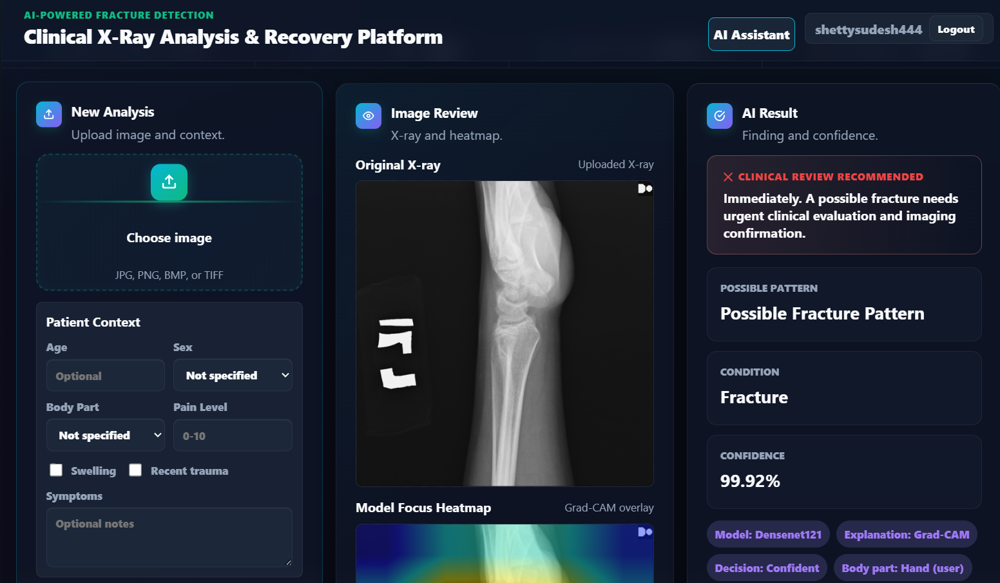
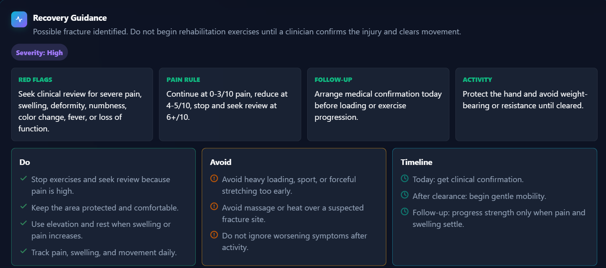
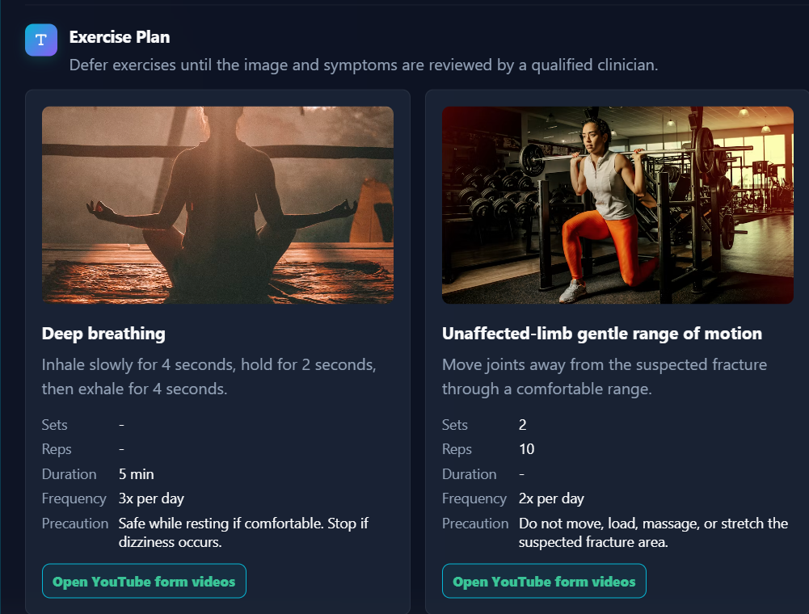
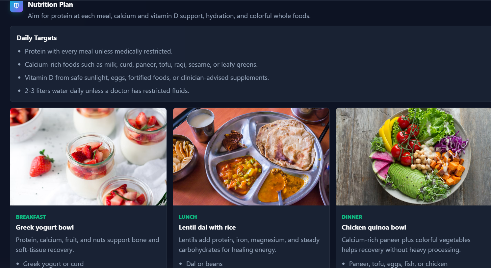
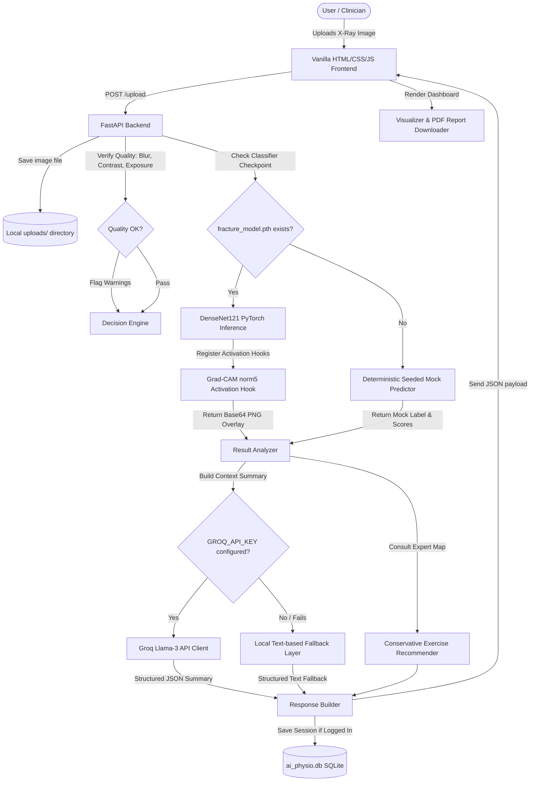

# 🩺 AI Physio — Educational Bone X-Ray Analysis & Physiotherapy Recommender

[](https://fastapi.tiangolo.com/)
[](https://pytorch.org/)
[](https://opencv.org/)
[](https://www.sqlite.org/)
[](https://groq.com/)

AI Physio is an educational, full-stack portfolio application demonstrating how computer vision (DenseNet121), model interpretability (Grad-CAM), expert rule-based systems, and Large Language Models (Groq Llama-3) can be integrated into a clinical assistant dashboard.

---

> [!WARNING]  
> **MEDICAL DISCLAIMER & INTENDED USE**  
> AI Physio is an **educational project and portfolio demonstration**. It is **not a medical device**, has not been certified by any regulatory authority (like the FDA or EMA), and **must not be used** as a replacement for professional clinical diagnosis, treatment planning, or emergency triage. Suspicion of bone fractures or joint dislocations requires immediate professional imaging and care.

---

## 📸 Dashboard Preview
## 📸 Dashboard Preview

### Dashboard


### X-Ray Analysis & Heatmap


### Recovery Guidance


### Exercise Plan


### Nutrition Plan


The application features a clean, responsive, clinical-style browser dashboard:
*   **Dual View Comparison**: Interactive image comparisons showing the uploaded X-ray side-by-side with its computed **Grad-CAM interpretability overlay**.
*   **Image Quality Inspections**: Automatic preprocessing warnings identifying low contrast, blur, under/over-exposure, or insufficient resolution.
*   **Performance Metrics Hub**: Interactive rendering of evaluation confusion matrices (`confusion_matrix_validation.png`, `confusion_matrix_test.png`) and validation reports straight from the trained PyTorch classifier.
*   **Downloadable Clinical Reports**: Instant generation of structured patient-ready summaries.

---

## ⚙️ Architecture & Data Flow

Below is the execution flow of the application from image ingestion to recommendation generation and database logging:



---

## 🚀 Key Features

*   **Deep Learning Fracture Classifier**: Uses a fine-tuned **DenseNet121** model implemented in PyTorch to distinguish between `fractured` and `not_fractured` scans.
*   **Model Explainability (Grad-CAM)**: Visualizes model focus regions on real inferences using gradient-weighted class activation mapping at the final normalization layer (`features.norm5`).
*   **Robust Fallback Inference**: Automatically falls back to deterministic mock predictions derived from image feature metrics if the classifier checkpoint is missing, ensuring a functional UI demo at all times.
*   **Structured Physiotherapy Recommendations**: Maps predicted class outcomes to conservative, safety-first exercise routines, dietary guidelines, and clinical escalations.
*   **Patient-Friendly LLM Explanations**: Uses Groq Llama-3 to generate conversational, patient-safe summaries of findings. Falls back gracefully to localized formatting if the API key is absent, rate-limited, or offline.
*   **Local Accounts & Case History**: Secured registration and session login, letting users save, list, and review past case uploads stored in a local SQLite database.

---

## 📂 Project Structure

```text
AI_Physio/
│
├── backend/                       # Python API Backend
│   ├── uploads/                   # Temporary directory for uploaded scans
│   ├── app.py                     # FastAPI entry point, Auth, Router, and DB setup
│   ├── predict.py                 # PyTorch model loader, pre-processing, and Grad-CAM
│   ├── recommendation.py          # Expert rules, diet advice, and exercise plans
│   ├── llm_explanation.py         # Groq LLM integration and localized fallback layers
│   ├── recovery_guidance.py       # Helper scripts for system environment checks
│   └── report.py                  # Structured HTML to PDF/Print report generator
│
├── dataset/                       # Source files for model training
│   ├── train/                     # Training split directory (sub-folders by class)
│   ├── val/                       # Validation split directory
│   └── test/                      # Test split directory
│
├── frontend/                      # Web Dashboard Assets
│   ├── index.html                 # Main clinical dashboard layout
│   ├── styles.css                 # Custom premium Dark Mode dashboard styles
│   └── app.js                     # Dashboard state management and API requests
│
├── notebooks/                     # Deep Learning Scripts
│   ├── train_model.py             # Transfer learning training pipeline using PyTorch
│   └── evaluate_model.py          # Detailed precision, recall, confusion matrix generator
│
├── requirements.txt               # Backend Python dependencies
└── evaluation_metrics.json        # Saved evaluation scores (produced by evaluate_model.py)
```

---

## 🛠️ Local Setup & Running

This project is tested and designed to run in local environments. Follow these instructions to set it up:

### 1. Prerequisite Installations
Make sure you have **Python 3.10+** installed on your machine.

### 2. Set Up Virtual Environment & Dependencies
Clone the repository, initialize a virtual environment, and install dependencies:

```powershell
# Create virtual environment
python -m venv .venv

# Activate on Windows (PowerShell)
Set-ExecutionPolicy -Scope Process -ExecutionPolicy Bypass
.\.venv\Scripts\Activate.ps1

# Activate on macOS/Linux
source .venv/bin/activate

# Install requirements
pip install -r requirements.txt
```

### 3. Running the Dev Server
Launch the backend FastAPI application:

```bash
uvicorn backend.app:app --reload
```

The server starts on `http://127.0.0.1:8000`. Open your browser and navigate to:
*   **Clinical UI Dashboard**: [http://127.0.0.1:8000/frontend/index.html](http://127.0.0.1:8000/frontend/index.html)
*   **Interactive Swagger Docs**: [http://127.0.0.1:8000/docs](http://127.0.0.1:8000/docs)

---

## 🧠 Model Training & Evaluation

The system supports a custom classification workflow. To train the model yourself:

### 1. Populate the Dataset
Ensure your `dataset/` directory contains structured splits:
```text
dataset/
  ├── train/
  │     ├── fractured/
  │     └── not_fractured/
  ├── val/ ...
  └── test/ ...
```

### 2. Run Training
Start the transfer-learning pipeline. The script downloads pretrained ImageNet weights, freezes initial DenseNet blocks to speed up training, unfreezes the final feature extraction block (`denseblock4` + `norm5`) for fine-tuning, and fits the classification head:

```powershell
python notebooks/train_model.py
```
This produces:
*   `backend/fracture_model.pth` (Model weights)
*   `backend/class_names.json` (Target label map)
*   `dataset_skipped_images.json` (List of corrupted images skipped automatically)

> [!TIP]  
> **Smoke Testing Datasets**: To quickly check if the dataloaders are working without committing to a full training session, run:
> ```powershell
> $env:AI_PHYSIO_SMOKE_TEST="1"
> python notebooks/train_model.py
> Remove-Item Env:\AI_PHYSIO_SMOKE_TEST
> ```

### 3. Run Evaluation
Assess model reliability, compute weighted macro/micro metrics, and save PNG plots of the confusion matrix:

```powershell
python notebooks/evaluate_model.py
```
This updates `evaluation_metrics.json` and outputs validation and testing confusion matrices (`confusion_matrix_validation.png` and `confusion_matrix_test.png`) in the project root, which are automatically visualized by the clinical frontend dashboard.

---

## 🔧 Environment Configurations

Customize backend executions using environment variables:

| Variable | Type | Default Value | Description |
| --- | --- | --- | --- |
| `GROQ_API_KEY` | String | `None` | API key for Groq. If left blank, LLM features default to the local fallback helper. |
| `AI_PHYSIO_LLM_MODEL` | String | `openai/gpt-oss-20b` | Model endpoint targeted on Groq (or compatible LLM providers). |
| `AI_PHYSIO_SMOKE_TEST` | String | `None` | Set to `"1"` to run a data loader check without running full training epochs. |
| `AI_PHYSIO_EPOCHS` | Integer | `5` | Number of training epochs to execute during model training. |
| `AI_PHYSIO_BATCH_SIZE` | Integer | `48` | DataLoader batch size used during training. |

---

## 🔌 API Documentation

### Authentication & User Profiles

*   `POST /auth/register` - Create a local clinician account.
*   `POST /auth/login` - Log in and obtain a JWT bearer token.
*   `POST /auth/logout` - Clear the active session token.
*   `GET /auth/me` - Fetch details of the currently authenticated user.

### Diagnostics & Analytics

*   `POST /upload` - Upload an raw X-ray scan. Returns a unique `file_id`.
*   `POST /predict/{file_id}` - Run model inference on the uploaded scan. Returns class confidences.
*   `POST /analyze/{file_id}` - Runs full inference, retrieves clinical/exercise recommendations, queries Groq for the patient summary, and logs the session to the local database (if logged in).
*   `GET /conditions` - List all supported condition keys mapped in the system.
*   `GET /metrics` - Retrieve overall classifier evaluation parameters and reports.
*   `GET /confusion-matrix/{split}` - Serves generated confusion matrix images (`test` or `validation`).

### Case Management

*   `GET /cases` - Retrieves all historical cases stored for the logged-in user.
*   `GET /cases/{case_id}` - Pulls analysis details for a previous case.

---

## 🔍 Technical Deep-Dive

### Preprocessing Pipeline
To match the requirements of the pre-trained DenseNet121 backbone, incoming images are transformed as follows:
1.  **Grayscale Loading**: Input scans are converted to grayscale to uniform single-channel inputs (safeguarded by PIL conversions if OpenCV fails).
2.  **CLAHE Enhancement**: Contrast Limited Adaptive Histogram Equalization is applied to amplify fine bone structures and fracture lines.
3.  **Resize**: Normalized to $160 \times 160$ px (customizable during training via `AI_PHYSIO_IMAGE_SIZE`).
4.  **Channel Expansion**: Duplicated to three RGB channels.
5.  **ImageNet Normalization**: Preprocessed using ImageNet channel means `[0.485, 0.456, 0.406]` and standard deviations `[0.229, 0.224, 0.225]`.

### Grad-CAM Implementation
Explainability heatmaps highlight regions that contributed most to the prediction score:
*   A PyTorch forward hook is registered at the target convolutional normalization layer (`model.features.norm5`).
*   On inference, gradients are captured via `score.backward()` relative to the predicted class index.
*   Gradients are average-pooled across height and width to compute activation weights.
*   The weighted combinations of forward activation maps are computed, filtered through a ReLU (to highlight positive contributions), resized, and overlaid as a jet colormap onto the original gray image.
